# HEMANTH G

### Final-year B.Tech Information Technology Student · Developer · Problem Solver

 

<table>
<tr>

<td valign="top">

</td>

<td valign="top">

</td>

</tr>
</table>

---

## About Me

Final-year **B.Tech Information Technology** student at **Manakula Vinayagar Institute of Technology, Puducherry**, with knowledge of Java, JavaScript, SQL, MongoDB and web development.

Interested in **software engineering, application development, networking, data analytics, IoT and problem solving**.

---

## Technical Skills

### Programming Languages

`Java` `JavaScript` `Python`

### Frontend Development

`HTML` `CSS` `JavaScript` `React.js`

### Databases

`MySQL` `SQL` `MongoDB`

### Data & Analytics

`Power BI` `Data Analytics`

### IoT & Embedded Systems

`Arduino` `ESP32` `IR Sensors` `LiFi` `LoRa`

### Tools & Platforms

`Git` `GitHub` `Figma` `Canva` `UiPath Studio`

### Networking

`CCNA` `Switching` `Routing` `Wireless` `Network Troubleshooting`

---

## Projects

### 🏥 Medical History Management Website

**Technologies:** `Java` `HTML` `CSS` `JavaScript` `MongoDB`

A digital personal health record platform designed to manage and organize medical information efficiently.

Key features include:

- Medical record management
- Lab report management
- Prescription management
- Vital health record management
- User-friendly interface

---

### 🔐 AI-Powered Secure Digital Evidence Collection and Analysis System

**Technologies:** `Java` `Spring Boot` `REST API` `React.js` `MongoDB`

A secure digital evidence management system designed to authenticate investigators and maintain the integrity of digital evidence.

Key features:

- Investigator authentication
- Secure evidence submission
- SHA-256 integrity verification
- AI-based evidence analysis
- Incident timeline reconstruction
- Automated forensic report generation

---

### 🚗 Smart Car Autonomous Speed Control System

**Technologies:** `ESP32` `Embedded C` `IR Sensor` `LiFi` `LoRa SX1278` `PWM` `L298N` `Blynk`

An IoT-based smart vehicle system designed to automatically detect restricted zones, receive speed-limit information and regulate vehicle speed.

Key features:

- ESP32-based control
- IR sensor detection
- LiFi communication
- LoRa communication
- PWM-based motor control
- Bluetooth manual control
- Blynk monitoring
- LCD status display
- Emergency override
- Fail-safe mechanism

---

## Experience

### Data Analyst — NEXTGEN SOLUTION

**June 2025 – July 2025**

- Worked with data-driven workflows and reporting.
- Identified and troubleshot data-related issues.
- Developed dashboards using Power BI.
- Analyzed data to identify useful insights.
- Applied structured problem-solving approaches.

---

### Frontend Developer — MOTION CUT

**February 2025 – March 2025**

- Developed responsive web components.
- Worked with HTML, CSS and JavaScript.
- Debugged frontend issues.
- Collaborated with team members to complete development tasks.
- Gained practical experience in frontend development.

---

## Education

### Manakula Vinayagar Institute of Technology

**2023 – 2027**

**Bachelor of Technology — Information Technology**

**CGPA: 8.5**

Puducherry, India

---

### Seventh Day Adventist Higher Secondary School

**HSC — 2023:** 73.33%

**SSLC — 2021:** Pass

---

## Certifications

- **CCNA: Switching, Routing & Wireless Essentials**  
  Cisco Networking Academy

- **Java Programming**  
  Spoken Tutorial Project — IIT Bombay

- **Automation Developer Associate Training (v2024.10)**  
  ICT Academy — Cohort 2

- **Honors Diploma in Computer Programming**  
  SARVA I.T & Educational Development

---

## Achievements

### 🏆 1st Prize — National Technology Week Students Project Exhibition

**IQAC & R&D Cell, MVIT, Puducherry — 2026**

---

## Research Publication

### Big Data Privacy and Security in Data Analytics

**A Review on Issues, Challenges, and Privacy-Preserving Methods**

Published in:

**IRJASH — Vol. 07, Issue 02, 2025**

**DOI:** `10.47392/IRJASH.2025.011`

---

## Areas of Interest

<table>
<tr>
<td align="center">💻 <b>Software Development</b></td>
<td align="center">🌐 <b>Web Development</b></td>
<td align="center">📊 <b>Data Analytics</b></td>
</tr>
<tr>
<td align="center">🔐 <b>Cybersecurity</b></td>
<td align="center">🌐 <b>Networking</b></td>
<td align="center">🤖 <b>IoT</b></td>
</tr>
</table>

---

## GitHub Activity

  

---

## Connect With Me

---

### Code · Learn · Build · Solve

 

  

⭐ **Thanks for visiting my profile!**

