<div align="center">

# `hemanth@github:~$ whoami`

### HEMANTH G
**Information Technology Student · Developer · Problem Solver**



<br><br>

<table>
<tr>
<td valign="top"></td>
<td valign="top"></td>
</tr>
</table>

</div>

---

## `hemanth@github:~$ cat about.txt`

I'm **Hemanth G**, a final-year **B.Tech Information Technology** student at **Manakula Vinayagar Institute of Technology, Puducherry**.

I enjoy building practical applications across **web development, data analytics, AI, cybersecurity and IoT**.

```text
> Build
> Learn
> Experiment
> Solve
> Improve
```

---

## `hemanth@github:~$ ls ./skills`

<div align="center">


</div>

---

## `hemanth@github:~$ ls ./projects`

### 🏥 MedHistory
Personal health-record PWA for organizing medical information digitally.

### 🔐 CRYPTEVID
Secure digital evidence management and forensic intelligence platform.

### 📊 Data Analytics
Interactive dashboards and analytics solutions using Power BI and SQL.

### 🌐 Web Applications
Responsive applications built with modern frontend and backend technologies.

---

## `hemanth@github:~$ ./current-focus.sh`

```text
[✓] Java & DSA
[✓] Web Development
[✓] SQL & Data Analytics
[✓] AI / Cybersecurity Projects
[✓] IoT & ESP32
[→] Building better projects
[→] Preparing for software engineering opportunities
```

---

<div align="center">

### `Code · Learn · Build · Repeat.`

<a href="https://github.com/Hemanth-205"></a>
<a href="mailto:grhemanth26@gmail.com"></a>

</div>
